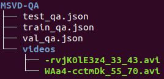

# Metadata
**Title:** Video Language Co-Attention with Fast-Learning Feature Fusion for VideoQA

| <center>Author(s)</center> | <center>Venue</center> | <center>Year</center> | <center>Paper</center> | <center>Code</center> | <center>Models</center> |
| :---: | :---: | :---: | :---: | :---: | :---: |
| Joint submission @abdessaied & @sood | Repl4NLP @ ACL | 2022 |[:leaves:](https://www.overleaf.com/project/609624cd3cd1ae7de563a7f4)[📜](https://git.hcics.simtech.uni-stuttgart.de/submissions/neurips2021_adnen_ekta/-/tree/master/paper) | [💻](https://git.hcics.simtech.uni-stuttgart.de/submissions/neurips2021_adnen_ekta/-/tree/master/code) | [⬇️](https://drive.google.com/drive/folders/172yj4iUkF1U1WOPdA5KuKOTQXkgzFEzS?usp=sharing) | 

# Overview
<p align="center"></p>

# Results 
Our VLCN model achieves **new** state-of-the-art results on two open-ended VideoQA datasets **MSVD-QA** and **MSRVTT-QA**.
#### MSVD-QA
| <center>Model</center> | <center>What</center> | <center>Who</center> | <center>How</center> | <center>When</center> | <center>Where</center> | <center>All</center> |
| :---: | :---: | :---: | :---: | :---: | :---: | :---: |
|  ST-VQA | 18.10 | 50.00 | **83.80** | 72.40 | 28.60 | 31.30 |
|  Co-Mem | 19.60 | 48.70 | 81.60 | 74.10 | 31.70 | 31.70 |
|  HMEMA  | 22.40 | 50.00 | 73.00 | 70.70 | 42.90 | 33.70 |
|  SSML   | - | - | - | - | - | 35.13 |
|  QueST   | 24.50 | **52.90** | 79.10 | 72.40 | **50.00** | 36.10 |
|  HCRN   | - | - | - | - | - | 36.10 |
|  MA-DRNN   | 24.30 | 51.60 | 82.00 | **86.30** | 26.30 | 36.20 |
|  **VLCN (Ours)**   | **28.42** | 51.29 | 81.08 | 74.13 | 46.43 | **38.06** |

#### MSRVTT-QA
| <center>Model</center> | <center>What</center> | <center>Who</center> | <center>How</center> | <center>When</center> | <center>Where</center> | <center>All</center> |
| :---: | :---: | :---: | :---: | :---: | :---: | :---: |
|  ST-VQA | 24.50 | 41.20 | 78.00 | 76.50 | 34.90 | 30.90 |
|  Co-Mem | 23.90 | 42.50 | 74.10 | 69.00 | **42.90** | 32.00 |
|  HMEMA  | 22.40 | **50.10** | 73.00 | 70.70 | 42.90 | 33.70 |
|  QueST   | 27.90 | 45.60 | **83.00** | 75.70 | 31.60 | 34.60 |
|  SSML   | - | - | - | - | - | 35.00 |
|  HCRN   | - | - | - | - | - | 35.60 |
|  **VLCN (Ours)**   | **30.69** | 44.09 | 79.82 | **78.29** | 36.80 | **36.01** |

# Requirements 
- PyTorch 1.3.1<br/>
- Torchvision 0.4.2<br/>
- Python 3.6

# Raw data
The raw data of MSVD-QA and MSRVTT-QA are located in 
``
data/MSVD-QA
``
and 
``
data/MSRVTT-QA
``
, respectively.<br/>

**Videos:** The raw videos of MSVD-QA and MSRVTT-QA can be downloaded from [⬇](https://www.cs.utexas.edu/users/ml/clamp/videoDescription/) and [⬇](https://www.mediafire.com/folder/h14iarbs62e7p/shared), respectively.<br/>
**Text:** The text data can be downloaded from [⬇](https://github.com/xudejing/video-question-answering).<br/>

After downloading all the raw data, ``
data/MSVD-QA
``
and 
``
data/MSRVTT-QA
``
should have the following structure:
<p align="center"></p>

# Preprocessing
To sample the individual frames and clips and generate the corresponding visual features, we run the script 
``
preporocess.py
``
on the raw videos with the appropriate flags. E.g. for MSVD-QA we have to execute
```bash
python core/data/preporocess.py --RAW_VID_PATH /data/MSRVD-QA/videos --C3D_PATH path_to_pretrained_c3d
```
This will save the individual frames and clips in 
``
data/MSVD-QA/frames
``
and 
``
data/MSVD-QA/clips
``
, respectively, and their visual features in 

``
data/MSVD-QA/frame_feat
``
and 
``
data/MSVD-QA/clip_feat
``, respectively.

# Config files
Before starting training, one has to update the config path file
``
cfgs/path_cfgs.py
``
with the paths of the raw data as well as the visual feaures.<br/>
All Hyperparameters can be adjusted in 
``
cfgs/base_cfgs.py
``.

# Training
To start training, one has to specify an experiment directory
``
EXP_NAME
``
where all the results (log files, checkpoints, tensorboard files etc) will be saved. Futhermore, one needs to specify the
``
MODEL_TYPE
`` 
of the VLCN to be trained.
| <center>MODEL_TYPE</center> | <center>Description</center> |
| :---: | :---: |
|  1 | VLCN      |
|  2 | VLCN-FLF  |
|  3 | VLCV+LSTM |
|  4 | MCAN      |

These parameters can be set inline. E.g. by executing
```bash
python run.py --EXP_NAME experiment --MODEL_TYPE 1 --DATA_PATH /data/MSRVD-QA --GPU 1 --SEED 42
```

# Acknowledgements
We thank the Vision and Language Group@ MIL for their [MCAN](https://github.com/MILVLG/mcan-vqa) open source implementation, [DavidA](https://github.com/DavideA/c3d-pytorch/blob/master/C3D_model.py) for his pretrained C3D model and finally [ixaxaar](https://github.com/ixaxaar/pytorch-dnc) for his DNC implementation.
