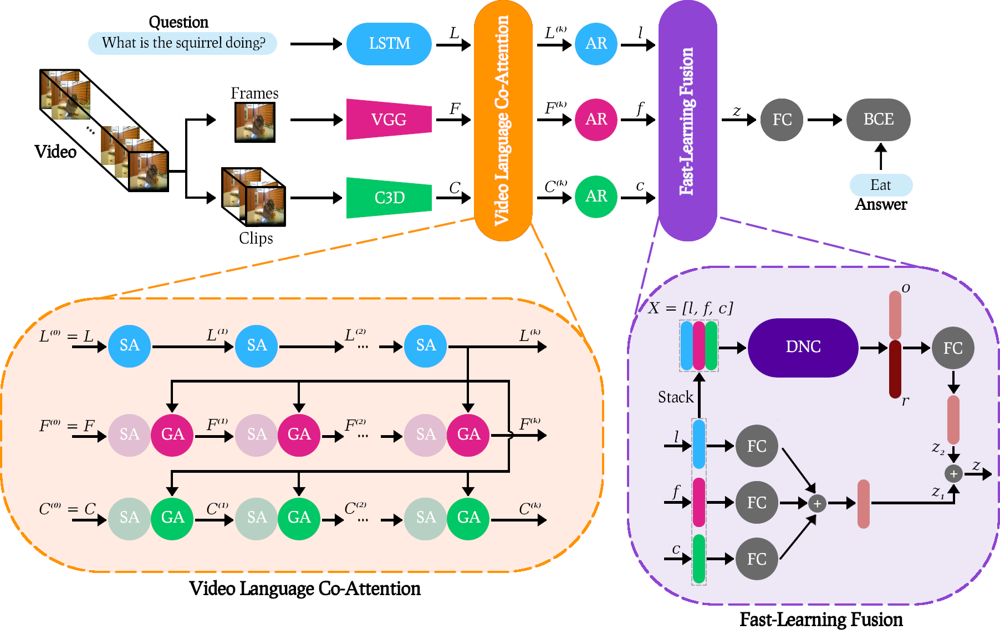

<div align="center">
<h1> Video Language Co-Attention with Fast-Learning Feature Fusion for VideoQA </h1>

**[Adnen Abdessaied][1], &nbsp; [Ekta Sood][2], &nbsp; [Andreas Bulling][3]** <br>

**Published at [Relp4NLP @ ACL 2022][4] 🇮🇪: [[PDF][5]]** <br>
</div>

# Citation 
If you find our code useful or use it in your own projects, please cite our paper:

```bibtex
@inproceedings{abdessaied-etal-2022-video,
    title = "Video Language Co-Attention with Multimodal Fast-Learning Feature Fusion for {V}ideo{QA}",
    author = "Abdessaied, Adnen  and Sood, Ekta  and Bulling, Andreas",
    booktitle = "Proceedings of the 7th Workshop on Representation Learning for NLP",
    year = "2022",
    url = "https://aclanthology.org/2022.repl4nlp-1.15",
    pages = "143--155",
}
```

# Abstract
We propose the Video Language CoAttention Network (VLCN) – a novel memory-enhanced model for Video Question Answering (VideoQA). Our model combines two original contributions: A multimodal fast-learning feature fusion (FLF) block and a mechanism that uses selfattended language features to separately guide neural attention on both static and dynamic visual features extracted from individual video frames and short video clips. When trained from scratch, VLCN achieves competitive results with the state of the
art on both MSVD-QA and MSRVTT-QA with 38.06% and 36.01% test accuracies, respectively. Through an ablation study, we further show that FLF improves generalization across different VideoQA datasets and performance for question types that are notoriously challenging in current datasets, such as long questions that require deeper reasoning as well as questions with rare answers

# Overview
<p align="center"></p>

# Results 
Our VLCN model achieves **new** state-of-the-art results on two open-ended VideoQA datasets **MSVD-QA** and **MSRVTT-QA**.
#### MSVD-QA
| <center>Model</center> | <center>What</center> | <center>Who</center> | <center>How</center> | <center>When</center> | <center>Where</center> | <center>All</center> |
| :---: | :---: | :---: | :---: | :---: | :---: | :---: |
|  ST-VQA | 18.10 | 50.00 | **83.80** | 72.40 | 28.60 | 31.30 |
|  Co-Mem | 19.60 | 48.70 | 81.60 | 74.10 | 31.70 | 31.70 |
|  HMEMA  | 22.40 | 50.00 | 73.00 | 70.70 | 42.90 | 33.70 |
|  SSML   | - | - | - | - | - | 35.13 |
|  QueST   | 24.50 | **52.90** | 79.10 | 72.40 | **50.00** | 36.10 |
|  HCRN   | - | - | - | - | - | 36.10 |
|  MA-DRNN   | 24.30 | 51.60 | 82.00 | **86.30** | 26.30 | 36.20 |
|  **VLCN (Ours)**   | **28.42** | 51.29 | 81.08 | 74.13 | 46.43 | **38.06** |

#### MSRVTT-QA
| <center>Model</center> | <center>What</center> | <center>Who</center> | <center>How</center> | <center>When</center> | <center>Where</center> | <center>All</center> |
| :---: | :---: | :---: | :---: | :---: | :---: | :---: |
|  ST-VQA | 24.50 | 41.20 | 78.00 | 76.50 | 34.90 | 30.90 |
|  Co-Mem | 23.90 | 42.50 | 74.10 | 69.00 | **42.90** | 32.00 |
|  HMEMA  | 22.40 | **50.10** | 73.00 | 70.70 | 42.90 | 33.70 |
|  QueST   | 27.90 | 45.60 | **83.00** | 75.70 | 31.60 | 34.60 |
|  SSML   | - | - | - | - | - | 35.00 |
|  HCRN   | - | - | - | - | - | 35.60 |
|  **VLCN (Ours)**   | **30.69** | 44.09 | 79.82 | **78.29** | 36.80 | **36.01** |

# Requirements 
- PyTorch 1.3.1<br/>
- Torchvision 0.4.2<br/>
- Python 3.6

# Raw data
The raw data of MSVD-QA and MSRVTT-QA are located in 
``
data/MSVD-QA
``
and 
``
data/MSRVTT-QA
``
, respectively.<br/>

**Videos:** The raw videos of MSVD-QA and MSRVTT-QA can be downloaded from [⬇](https://www.cs.utexas.edu/users/ml/clamp/videoDescription/) and [⬇](https://www.mediafire.com/folder/h14iarbs62e7p/shared), respectively.<br/>
**Text:** The text data can be downloaded from [⬇](https://github.com/xudejing/video-question-answering).<br/>

After downloading all the raw data, ``
data/MSVD-QA
``
and 
``
data/MSRVTT-QA
``
should have the following structure:
<p align="center"></p>

# Preprocessing
To sample the individual frames and clips and generate the corresponding visual features, we run the script 
``
preporocess.py
``
on the raw videos with the appropriate flags. E.g. for MSVD-QA we have to execute
```bash
python core/data/preporocess.py --RAW_VID_PATH /data/MSRVD-QA/videos --C3D_PATH path_to_pretrained_c3d
```
This will save the individual frames and clips in 
``
data/MSVD-QA/frames
``
and 
``
data/MSVD-QA/clips
``
, respectively, and their visual features in 

``
data/MSVD-QA/frame_feat
``
and 
``
data/MSVD-QA/clip_feat
``, respectively.

# Config files
Before starting training, one has to update the config path file
``
cfgs/path_cfgs.py
``
with the paths of the raw data as well as the visual feaures.<br/>
All Hyperparameters can be adjusted in 
``
cfgs/base_cfgs.py
``.

# Training
To start training, one has to specify an experiment directory
``
EXP_NAME
``
where all the results (log files, checkpoints, tensorboard files etc) will be saved. Futhermore, one needs to specify the
``
MODEL_TYPE
`` 
of the VLCN to be trained.
| <center>MODEL_TYPE</center> | <center>Description</center> |
| :---: | :---: |
|  1 | VLCN      |
|  2 | VLCN-FLF  |
|  3 | VLCV+LSTM |
|  4 | MCAN      |

These parameters can be set inline. E.g. by executing
```bash
python run.py --EXP_NAME experiment --MODEL_TYPE 1 --DATA_PATH /data/MSRVD-QA --GPU 1 --SEED 42
```
# Pre-trained models
Our pre-trained models are available here [⬇](https://drive.google.com/drive/folders/172yj4iUkF1U1WOPdA5KuKOTQXkgzFEzS)

# Acknowledgements
We thank the Vision and Language Group@ MIL for their [MCAN](https://github.com/MILVLG/mcan-vqa) open source implementation, [DavidA](https://github.com/DavideA/c3d-pytorch/blob/master/C3D_model.py) for his pretrained C3D model and finally [ixaxaar](https://github.com/ixaxaar/pytorch-dnc) for his DNC implementation.

# Contributors

- [Adnen Abdessaied][1]

For any questions or enquiries, don't not hesitate to contact the above contributor.

[1]: https://adnenabdessaied.de
[2]: https://perceptualui.org/people/sood/
[3]: https://perceptualui.org/people/bulling/
[4]: https://sites.google.com/view/repl4nlp2022/
[5]: https://aclanthology.org/2022.repl4nlp-1.15.pdf
